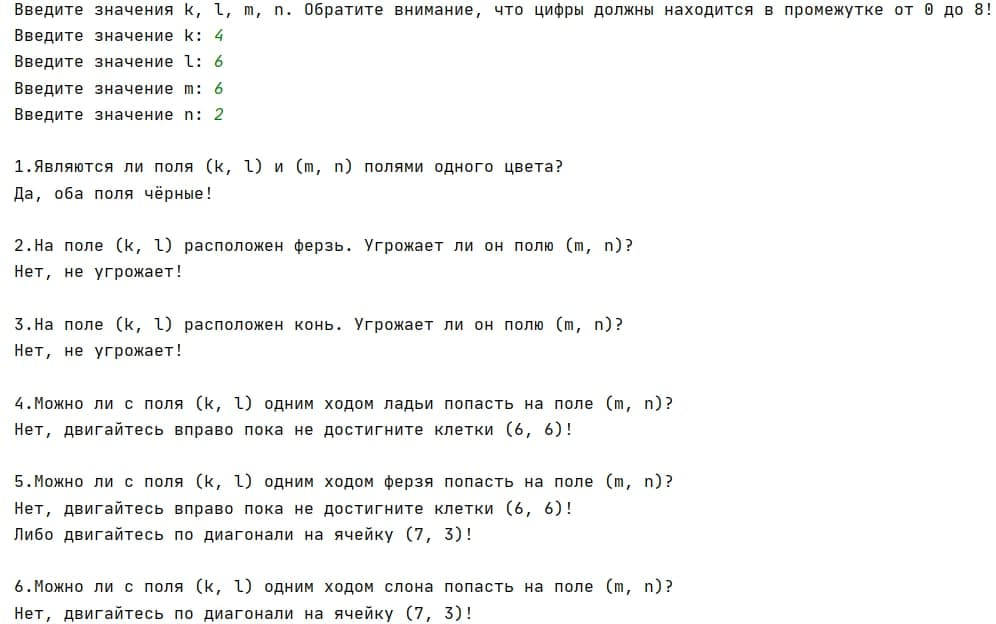

### **ОПИСАНИЕ НАЗНАЧЕНИЯ**    

Поле шахматной доски определяется парой натуральных чисел, каждое из которых не превосходит восьми: 
первое число— номер вертикали (при счете слева направо), второе— номер горизонтали (при счете снизу вверх).
Даны натуральные числа k, l, m, n, каждое из которых не превосходит восьми.

Программа создана для реализации алгоритма, генерирующего ответы на вопросы а)—е):

а) Выяснить, являются ли поля (k, I) и (m, n) полями одного цвета.

б) На поле (к, I) расположен ферзь. Угрожает ли он полю (m, n)?

в) На поле (к, I) расположен конь. Угрожает ли он полю (m, n)?

г) Выяснить, можно ли с поля (k, I) одним ходом ладьи попасть на поле (m, n). 

   Если нет, то выяснить, как это можно сделать за два хода (указать поле, на которое приводит первый ход).
   
д) Выяснить, можно ли с поля (k, I) одним ходом ферзя попасть на поле (m, n). 
   Если нет, то выяснить, как это можно сделать за два хода (указать поле, на которое приводит первый ход).
   
е) Выяснить, можно ли с поля (k, I) одним ходом слона попасть на поле (m, n). 
   Если нет, то выяснить, как это можно сделать за два хода (указать поле, на которое приводит первый ход).

### **ЗАПУСК ПРОГРАММЫ**        
Программу можно использовать в консоли (например, PyCharm или Visual Studio Code).

Для этого нужно совершить следующие действия:
``` bash
 # Скопируйте и вставте в терминал
$ git clone https://github.com/ohdora/chess
# Запустите проект
$ python chess.py

# Программа будет функционировать в вашей консоли
```
Либо просто скопируйте код по ссылке:
https://github.com/ohdora/chess/blob/master/chess_board.py


### **ВЫПОЛНЕНИЕ ОСНОВНЫХ ФУНКЦИЙ**      

``` bash
1) Пользователь вводит координаты полей k, l, m, n
2) Если введены некорректные данные, то программа просит ввести координаты снова
3) Программа выводит ответы на поставленные вопрсоы а)—е)
```


### **Пример вывода результата программы**



 


### **ЗАВЕРШЕНИЕ ПРОГРАММЫ**      
Программа закрывается автоматически после выполнения своих основных функций.
